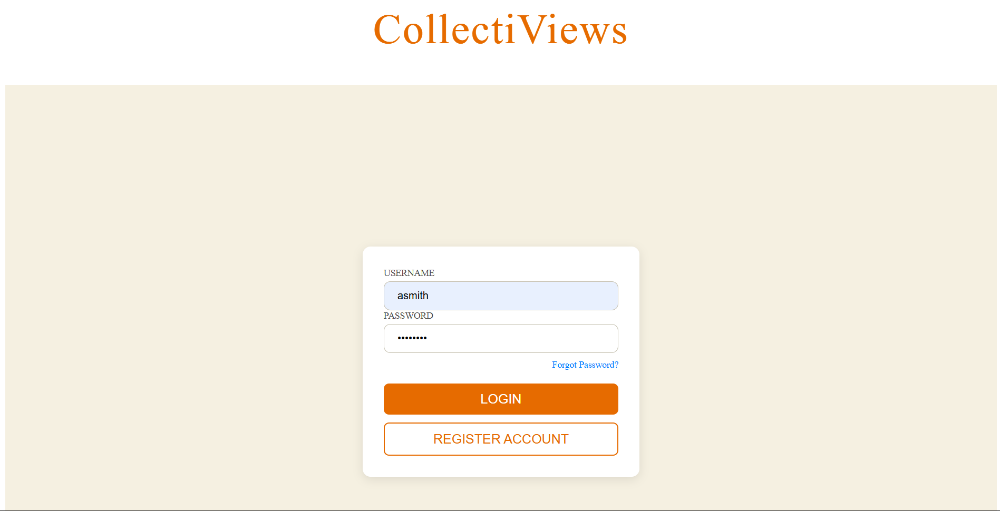
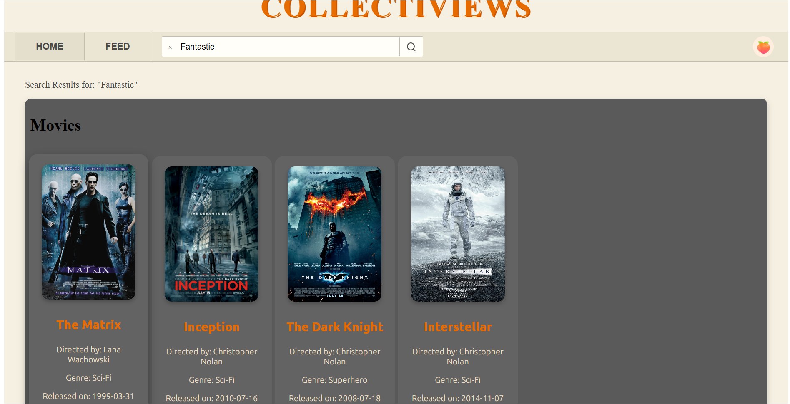
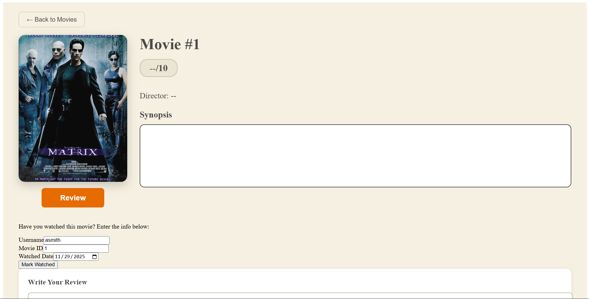
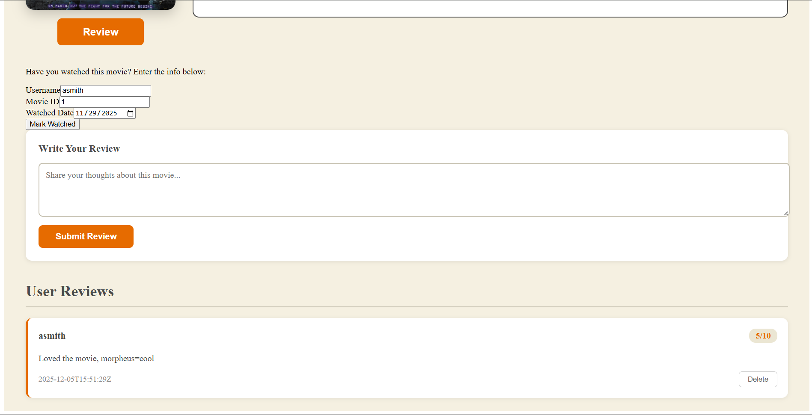

# Collectiviews

This project was generated using [Angular CLI](https://github.com/angular/angular-cli) version 20.3.8.

## How to start web application

1. Navigate to the API repository and perform the steps listed in the README to have the backend API and database operating: `https://github.com/WSU-kduncan/cs4900-api-fan4`
2. Now clone this repository and use the command `ng serve` in the terminal on the main branch of this repository.
3. Navigate to `http://localhost:4200/` on a search engine to be presented with the web application.
4. Refer to search engine's web developer tools to debug if any issues are found.

NOTE: The application will be updated automatically whenever a new change is saved in the code.

# Web application demos
Description: The CollectiViews web application was created using HTML, CSS, and TypeScript through the Angular framework. The project utilizes standalone component design. At the moment, a user can select a movie from available movies and leave a review. The review is then saved and updated in the database. The login page is not fully functional as no user authentication system is implemented. Below are demonstrations of these functionalities.

## Login

At the default URL, the user is greeted with a login page. The user can use their credentials to enter the web application.

IMAGE:



## Choose a movie

After logging in, the user can select which movie they would like to learn more about or review. They will then be presented information about the movie, ratings and reviews, and have the ability to leave their own review.

IMAGE:



## Write a review

Writing a review will automatically update the database using a create operation. A review can also be deleted and have changes updated in the database. In order to leave a review, a user must be in the database.

IMAGES: 





## Code scaffolding

Angular CLI includes powerful code scaffolding tools. To generate a new component, run:

```bash
ng generate component component-name
```

For a complete list of available schematics (such as `components`, `directives`, or `pipes`), run:

```bash
ng generate --help
```

## Building

To build the project run:

```bash
ng build
```

This will compile your project and store the build artifacts in the `dist/` directory. By default, the production build optimizes your application for performance and speed.

## Running unit tests

To execute unit tests with the [Karma](https://karma-runner.github.io) test runner, use the following command:

```bash
ng test
```

## Running end-to-end tests

For end-to-end (e2e) testing, run:

```bash
ng e2e
```

Angular CLI does not come with an end-to-end testing framework by default. You can choose one that suits your needs.

## Additional Resources

For more information on using the Angular CLI, including detailed command references, visit the [Angular CLI Overview and Command Reference](https://angular.dev/tools/cli) page.
